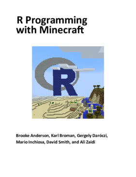

# Introduction

[Minecraft](https://minecraft.net) is awesome fun, especially in
creative mode, where you can build all sorts of crazy stuff. But
ambitious building projects can be really tedious to create by hand.
With the [miner R package](https://github.com/ropenscilabs/miner), you
can write [R](https://www.r-project.org) code to manipulate your
Minecraft world and create even more awesome stuff.

We developed the [miner](https://github.com/ROpenSciLabs/miner)
package and most of the examples in this book at the
[ROpenSci](https://ropensci.org) Unconference in Los Angeles,
California, in May, 2017. We are grateful to ROpenSci for bringing us
together.

Our work on R and Minecraft was inspired by an example at
<http://smarterpoland.pl> using R to make a [3D scatterplot in
minecraft](http://smarterpoland.pl/index.php/2016/09/minecharts-1-minecraft-r-edgar-andersons-iris-data/),
and by [Craig Richardson](https://twitter.com/craigargh)'s book [Learn
to Program with
Minecraft](https://www.nostarch.com/programwithminecraft) [@richardson2016].
