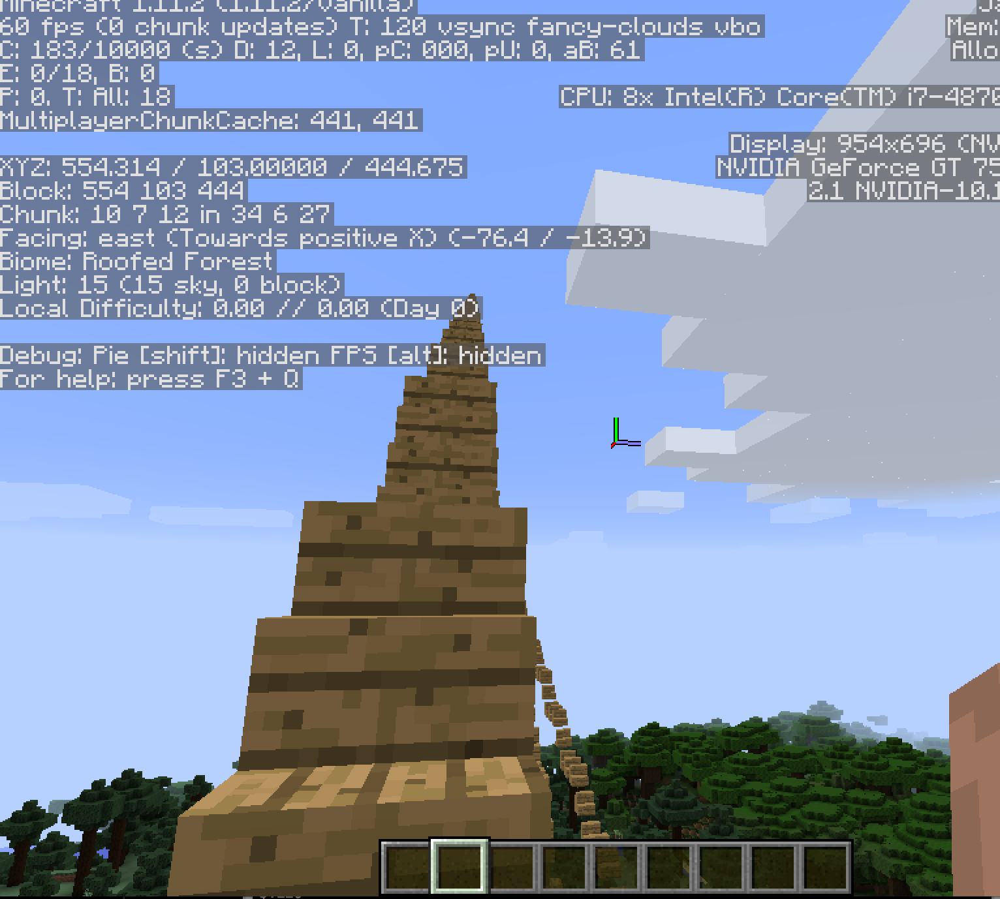

# A Stairway to Heaven

## Building Objects

The function to create objects in [miner](https://github.com/kbroman/miner) is the `setBlock` function. It expects four arguments, the first three being the coordinates of your item's location, and the fourth being the `block_id` you want to set. An optional argument is `block_style`.

We first load the [miner](https://github.com/kbroman/miner) package.

```{r setup}
library(miner)
```

First, you need to find out where you are, and before we do that we need to figure out who we are. You can use `getPlayerIds` to get the ids of all players currently in the Minecraft world. You can use the `getPlayerPos` function to find the position of each player. If you are the first player, you can pull your ID as the first element of the object returned by `getPlayerIds`:

```{r get_id, eval=FALSE}
ids <- getPlayerIds()
lapply(ids, getPlayerPos)
my_id <- ids[1]
```

## Stairway to heaven

We will create a matrix that contains our increments. First we create
a matrix with as many columns as we want stairs, and three rows
specifying our coordinates. The coordinates are obtained by
incrementing the first and second element of each column. We then use
`apply` to pass each column to the `setBlocks` function.

```{r create_block_pos, eval = FALSE}
# get your position
pos <- getPlayerPos(my_id, tile = TRUE)

# shift the position slightly,
#   so the stairs aren't right on top of you
pos <- pos + c(1, 0, 1)

# number of stairs to create
n_stairs <- 10

# matrix to contain stair locations
# first repeat the start position a bunch of times
stairs <- replicate(n_stairs, pos)

# for all but the first stair, move over and up one
# this is position relative to previous stair
upset <- cbind(rep(0, 3), replicate(n_stairs - 1, c(1, 1, 0)))

# for each row, use cumsum to get position relative to first stair
#    then transpose so that the result still has 3 rows
upset <- t(apply(upset, 1, cumsum))

# get final positions and transpose
#   now rows are stairs and columns are coordinates
stairs <- stairs + upset
```

We're almost ready to add our stairs, but first we need to get the
item ID for oak wood stairs.

```{r find_item_id}
find_item("Oak Wood Stairs")
```

Okay, so now we can add our stairs, using `id=53`.

```{r add_blocks, eval=FALSE}
# now add the stairs
apply(stairs, 2, function(x) setBlock(x[1], x[2], x[3], id = 53))
```

Here is an example of the resulting stairway:




We can call that last command a couple of more times, with shifts in
the last coordinate, to make an extra-wide, luxurious set of stairs.

```{r extra-wide, eval=FALSE}
apply(stairs, 2, function(x) setBlock(x[1], x[2], x[3]+1, id = 53))
apply(stairs, 2, function(x) setBlock(x[1], x[2], x[3]-1, id = 53))
```

Note: check out the function `buildStairs()` in the
[craft](https://github.com/kbroman/craft) package, which implements
this feature, building stairs going either down or up, in the
direction that a player is facing.
